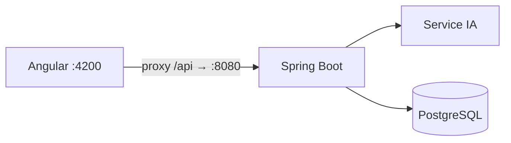

# LogiFlow — Frontend

Interface web du **TMS LogiFlow** (Transport Management System) pour le transport routier de
marchandises : référentiel, commandes, dossiers, voyages, flotte, chauffeurs, carburant,
maintenance, avec un **copilote IA** disponible sur tous les écrans.

LogiFlow est composé de trois projets, à placer côte à côte :

| Projet | Rôle | Port |
|---|---|---|
| **`logiflow-frontend`** (ce dépôt) | Interface Angular | 4200 |
| [`logiflow-backend`](../logiflow-backend) | API REST Spring Boot : seul interlocuteur du frontend | 8080 |
| [`logiflow-ai-service`](../logiflow-ai-service) | Agents IA (Flask), appelés uniquement par le backend | 8000 |



**Stack** :

- Angular 22 : composants autonomes, signals, `httpResource`, signal forms, zoneless ;
- TypeScript 6, Tailwind CSS 4, composants **Zard UI** (CDK), Leaflet (cartes) ;
- tests avec Vitest ; lint et format avec Ultracite / Biome ; gestionnaire **pnpm**.

---

## Fonctionnalités

| Espace | Écrans | Points clés |
|---|---|---|
| **Tableau de bord** | `/` | Indicateurs par module, raccourcis selon le rôle |
| **Référentiel** | Sites, clients, marchandises | Carte des sites, horaires, contraintes d'accès |
| **Commercial** | Commandes, dossiers | Lignes de commande, dossiers avec fenêtres de chargement et de livraison, statut |
| **Voyages** | Liste, création, fiche | Création **manuelle** ou **assistée par l'IA** (propositions comparées, formulaire pré-rempli) ; conformité avant création ; arrêts, capacité par tronçon, suivi, carte de l'itinéraire |
| **Flotte** | Véhicules, remorques | Compteurs, documents, section maintenance (échéances, OT, sinistres), score de santé |
| **Chauffeurs** | Liste, fiche, formulaire | Permis, habilitations et validité, disponibilité, voyages affectés, documents |
| **Carburant** | Prises, stations | Saisie, validation, justificatifs |
| **Maintenance** | Tableau de bord, OT, plans, sinistres, coûts, prestataires, assurances | Analyse prédictive IA avec « **Planifier l'OT** » ; workflow et clôture des OT, lignes de coût ; échéances des plans ; sinistres et suivi assurance ; coûts et sinistralité ; pièces jointes |
| **Administration** | Utilisateurs | Rôles |
| **Copilote** | Panneau latéral global | Conversations, réponses streamées en Markdown, outils en cours, sources cliquables, Stop, avis 👍/👎 |
| **Palette de commandes** | `Ctrl+K` | Navigation et actions rapides, recherche d'entités |

Les menus, les actions et les routes dépendent du **rôle** de l'utilisateur : ADMINISTRATEUR,
RESPONSABLE_EXPLOITATION, EXPLOITANT, COMMERCIAL, ATELIER ou CHAUFFEUR.

---

## Prérequis

- **Node.js 24.15+** (ou 22.22.3+). Le dépôt fixe Node **24.20.0** via `.npmrc`
  (`use-node-version`) : pnpm le télécharge même si le Node global est plus ancien.
- **pnpm 11+**.
- Le **backend** démarré sur `http://localhost:8080` (profil `local`), et, pour les fonctions
  IA, le **service IA**.

## Démarrage

```bash
pnpm install
pnpm start          # http://localhost:4200
```

Utilisez `pnpm start` plutôt qu'un `ng serve` global : il utilise la version de Node du dépôt.

### Connexion au backend

- Toutes les requêtes partent vers `/api/v1` (`src/environments/environment.ts`).
- En développement, `src/proxy.conf.json` redirige `/api` vers `http://localhost:8080` : il n'y
  a pas de CORS à configurer.
- Le frontend **n'appelle jamais** le service IA directement : tout passe par
  `/api/v1/ia/**` du backend.

### Se connecter (mode démonstration)

L'écran de connexion utilise une **session de démonstration** locale : mot de passe `demo`, et
l'un des identifiants suivants.

| Identifiant | Rôle |
|---|---|
| `admin` | ADMINISTRATEUR |
| `responsable` | RESPONSABLE_EXPLOITATION |
| `exploitant` | EXPLOITANT |
| `commercial` | COMMERCIAL |
| `atelier` | ATELIER |
| `chauffeur` | CHAUFFEUR |

La session (`core/auth/demo-session.ts`, `localStorage`) ne sert qu'à adapter l'interface. En
profil `local`, le backend authentifie toutes les requêtes comme ADMINISTRATEUR : les
restrictions par rôle ne sont appliquées que par l'interface. La connexion Keycloak (OAuth2 +
PKCE) est la cible pour les environnements partagés (voir
`logiflow-backend/docs/security.md`).

---

## Architecture

```
src/app/
  app.routes.ts          routes (chargées à la demande), protégées par rôle (roleGuard)
  app.config.ts          providers : routeur (liaison des paramètres aux inputs), HttpClient (fetch)
  core/
    api/                 erreurs HTTP (ProblemDetail → message), PageResponse, montants, graphe des entités
    auth/                session de démonstration, rôles, guards
    forms/               aides aux signal forms (erreurs de champ)
    nav/                 destinations par rôle, palette de commandes, icônes
  layout/                coquille connectée (menu, en-tête), panneau et bouton du copilote
  shared/ui/             kit d'écrans : listes (recherche, filtres, pagination, squelette), fiches,
                         formulaires (sections, champs, sélecteurs, dates ISO), statuts, carte, documents, toasts
  ia/                    clients IA : copilote (API, flux SSE, store, Markdown), planification, itinéraire
  tableau/               tableau de bord d'accueil
  <domaine>/             un dossier par domaine : sites, clients, marchandises, commandes, dossiers,
                         voyages, vehicules, remorques, chauffeurs, carburant, maintenance,
                         documents, utilisateurs, auth
```

Conventions (détail dans [AGENTS.md](AGENTS.md)) :

- **Lectures** avec `httpResource` : données réactives aux signals (filtres, pagination, `id` de
  route).
- **Écritures** dans un service `…Api` (`@Service`, `HttpClient` + `firstValueFrom`). Les erreurs
  sont affichées via `httpErrorMessage`.
- **Formulaires** en signal forms (`form`, `[formField]`, `required`, `validate`, `submit`), avec
  le kit `FORM_PAGE_IMPORTS`.
- **Pages** : liste (`…-page`), formulaire (`…-form-page`) et fiche (`…-detail-page`). Les
  paramètres de route et de requête arrivent en `input()`.
- **Composants** autonomes, `ChangeDetectionStrategy.OnPush` implicite, contrôle de flux
  `@if` / `@for`, accessibilité (labels, rôles ARIA, navigation au clavier).
- **Interface** : les libellés sont en français, le code suit le vocabulaire métier du backend
  (`OrdreTravail`, `Sinistre`, `Voyage`…).

### Fonctions IA côté interface

| Fonction | Fichiers | Fonctionnement |
|---|---|---|
| Copilote | `layout/copilote-panel.*`, `ia/copilote-*.ts` | `POST …/messages` lu avec `fetch` + `ReadableStream` (EventSource ne fait pas de POST), découpage des événements SSE (`copilote-sse.ts`), état dans `copilote-store.ts`, rendu Markdown sûr, liens de sources (`routeSource`) |
| Planification assistée | `voyages/voyage-create-page.*`, `ia/planification*.ts` | Période + type → propositions comparées → choix → formulaire pré-rempli → contrôle de conformité → création |
| Maintenance prédictive | `maintenance/maintenance-dashboard-page.*` | « Lancer l'analyse » ; pour chaque recommandation, « Planifier l'OT » ouvre le formulaire d'OT pré-rempli (origine `AGENT_IA`, créneau proposé) |
| Itinéraire | `ia/itineraire*.ts`, cartes Leaflet | Distance, durée et tracé d'un voyage |

Fonctionnement détaillé côté serveur : `logiflow-backend/docs/agents-ia.md`.

---

### Keycloak (real login)

1. Backend: `make keycloak` then run Spring with profile **`dev`** and `OAUTH2_ISSUER_URI` / `OAUTH2_JWK_SET_URI` (see [logiflow-backend/docs/security.md](../logiflow-backend/docs/security.md)).
2. Frontend: `pnpm start:keycloak` — redirects to Keycloak (`http://localhost:8081`), returns to `/connexion/retour`, sends `Authorization: Bearer` on API calls.

Test users match demo logins (`admin`, `exploitant`, …) with password **`demo`**.

## Scripts

| Commande | Effet |
|---|---|
| `pnpm start` | Session démo (sans Keycloak), proxy vers le backend — http://localhost:4200 |
| `pnpm start:keycloak` | Connexion OIDC via Keycloak local, JWT sur `/api/` |
| `pnpm build` | Build de production dans `dist/` |
| `pnpm test` | Tests unitaires (Vitest), en mode watch dans un terminal |
| `pnpm exec ng test --watch=false` | Tests en une passe (CI) |
| `pnpm exec ng test --watch=false --include="src/app/maintenance/**/*.spec.ts"` | Tests d'un dossier |
| `pnpm check` | Lint + format (Ultracite / Biome) |
| `pnpm fix` | Corrections automatiques |
| `pnpm exec ng generate component <nom>` | Générer un composant |

## Qualité

- **Ultracite** encapsule **Biome** ; Prettier et ESLint ne sont pas utilisés. Biome analyse le
  TypeScript ; les templates HTML sont vérifiés par le compilateur Angular (`pnpm build`), en
  diagnostics étendus.
- **Tests** : Vitest via le builder Angular. Les requêtes HTTP sont simulées avec
  `HttpTestingController`. Écrire les specs à côté des fichiers (`*.spec.ts`).
- Extensions recommandées (`.vscode/extensions.json`) : Angular Language Service, Biome,
  Tailwind IntelliSense.

## Styles

Tailwind **v4**, configuré dans le CSS, sans `tailwind.config.js` :

- `@import "tailwindcss";` et les jetons de thème dans `src/styles.css` ;
- PostCSS via `.postcssrc.json` (`@tailwindcss/postcss`) ;
- classes utilitaires directement dans les templates.

Les couleurs sémantiques (`pine`, `amber`, `brake`, `ink`, `muted`, `line`, `canvas`) sont
partagées par tout le kit.

## Dépannage

| Symptôme | Solution |
|---|---|
| `ng` refuse la version de Node | Passer par les scripts `pnpm`, qui utilisent Node 24.20.0 via `.npmrc`, ou mettre Node à jour (24.15+) |
| Erreurs 502/504 sur `/api` | Le backend n'est pas démarré sur le port 8080 |
| Le copilote affiche « service IA injoignable » | Démarrer `logiflow-ai-service` (`make run`) |
| « Clé LLM absente » dans le copilote | Renseigner `LLM_API_KEY` dans le `.env` du service IA |
| Un test Vitest dépasse ses 5 s sous charge | Le relancer seul : `--include=<fichier>` |
